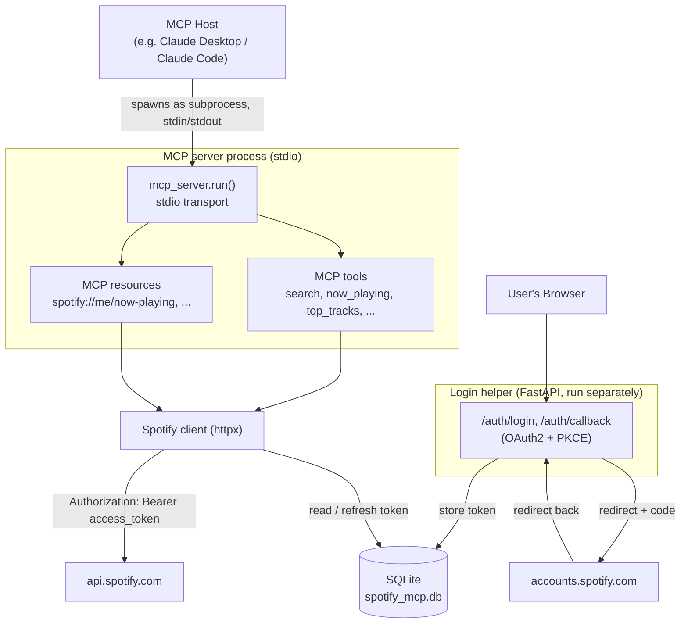

# spotify-mcp

An MCP (Model Context Protocol) server for interacting with the Spotify Web API, built with Python and FastAPI. Runs locally — an MCP host (Claude Desktop, Claude Code, etc.) launches it as a subprocess on your own machine.

This is a portfolio project. The reasoning behind every architecture decision — and why — is logged in [`journal/`](journal/), one entry per decision, in the order they were made.

## How it works

[MCP](https://modelcontextprotocol.io/) is an open protocol that lets an AI client (like Claude) talk to external tools and data sources through a standard interface, instead of custom one-off integrations. A client connects to a server, and the server exposes two kinds of things: **tools** — functions the model actively decides to call, with a name, description, and typed schema generated from the function's signature and docstring — and **resources** — read-only, URI-addressed data (e.g. `spotify://me/now-playing`) meant to be listed and attached to context more like a referenced document than an invoked action.

This project is two small, single-purpose local programs:

- **The MCP server itself** (`spotify_mcp.cli`, the `spotify-mcp` command), talking to its host over **stdio** — the host process launches it and communicates over stdin/stdout, no network involved. This is what an MCP-compatible client actually connects to.
- **A local login helper** (`spotify_mcp.main`, a small FastAPI app), run separately, that handles the Spotify OAuth2 (Authorization Code + PKCE) flow at `/auth/login` and `/auth/callback`. Spotify data (like "what's currently playing") is user-specific, so a logged-in user's access token is needed to call the Spotify API on their behalf. The login step needs a browser and an HTTP redirect regardless of how the MCP server itself talks to its host — that's a property of OAuth, not of MCP transport — so it's kept as its own small process rather than folded into the stdio one.

Once logged in, the access/refresh token pair is stored in a small SQLite database, shared by both processes, and transparently refreshed when it's close to expiring.



### Available tools

| Tool | Description |
|---|---|
| `ping` | Health check — confirms the MCP server is reachable. |
| `search_track` | Search Spotify's catalog for tracks matching a query. |
| `now_playing` | Get the track currently playing on the logged-in user's account, if any. |
| `top_tracks` | Get the user's most-listened-to tracks (short/medium/long term). |
| `top_artists` | Get the user's most-listened-to artists (short/medium/long term). |
| `recently_played` | Get the user's most recently played tracks. |
| `list_user_playlists` | List the logged-in user's playlists. |
| `playlist_tracks` | List the tracks in a playlist. |
| `create_user_playlist` | Create a new playlist. |
| `add_tracks` | Add one or more tracks to a playlist. |
| `remove_tracks` | Remove one or more tracks from a playlist. |
| `find_playlists` | Discover existing curated Spotify playlists matching a query (name/owner/description only — can't read tracks of playlists you don't own). |
| `import_youtube_playlist` | Build a new Spotify playlist from a YouTube video's tracklist (chapters/description — no audio recognition). |
| `pause` | Pause playback on the active device. |
| `resume` | Resume/start playback on the active device. |
| `skip_next` | Skip to the next track. |
| `skip_previous` | Skip to the previous track. |
| `set_playback_volume` | Set playback volume (0-100). |
| `queue_track` | Add a track to the playback queue. |

### Available resources

Read-only, returned as JSON.

| Resource | Description |
|---|---|
| `spotify://me/now-playing` | The track currently playing, if any. |
| `spotify://me/playlists` | The logged-in user's playlists. |
| `spotify://playlist/{playlist_id}` | The tracks in a specific playlist. |

## Setup

Requires Python 3.14+ and a Spotify account.

**1. Install dependencies** — pick one:

```bash
uv sync                             # with uv (recommended)
```
```bash
pip install -r requirements.txt     # or with plain pip — kept in sync with pyproject.toml via `uv export`
```

**2. Configure and log in:**

```bash
cp .env.example .env          # then set SPOTIFY_CLIENT_ID in .env — see below
uv run spotify-mcp login      # opens your browser, log in once
```

(Installed with plain `pip`? Drop the `uv run` prefix — just `spotify-mcp login`.)

**`SPOTIFY_CLIENT_ID`**: [create a Spotify app](https://developer.spotify.com/dashboard) → add `http://127.0.0.1:8000/auth/callback` as a Redirect URI → check **Web API** → copy the Client ID (no secret needed, this uses PKCE) → paste into `.env`.

**Register it with your MCP host:**

**Claude Code** — from the repo root:

```bash
claude mcp add spotify-mcp -- uv run --directory "$(pwd)" spotify-mcp
```

**Other hosts** (Claude Desktop, etc.) — add to the host's MCP config:

```json
{
  "mcpServers": {
    "spotify-mcp": {
      "command": "uv",
      "args": ["run", "--directory", "/absolute/path/to/spotify-mcp", "spotify-mcp"]
    }
  }
}
```

## Testing

```bash
uv run pytest
```

Tests run against an isolated, throwaway SQLite database and mocked Spotify API responses — they never touch a real Spotify account or the local `spotify_mcp.db`. See [journal entry 11](journal/11-test-suite.md) for details.
