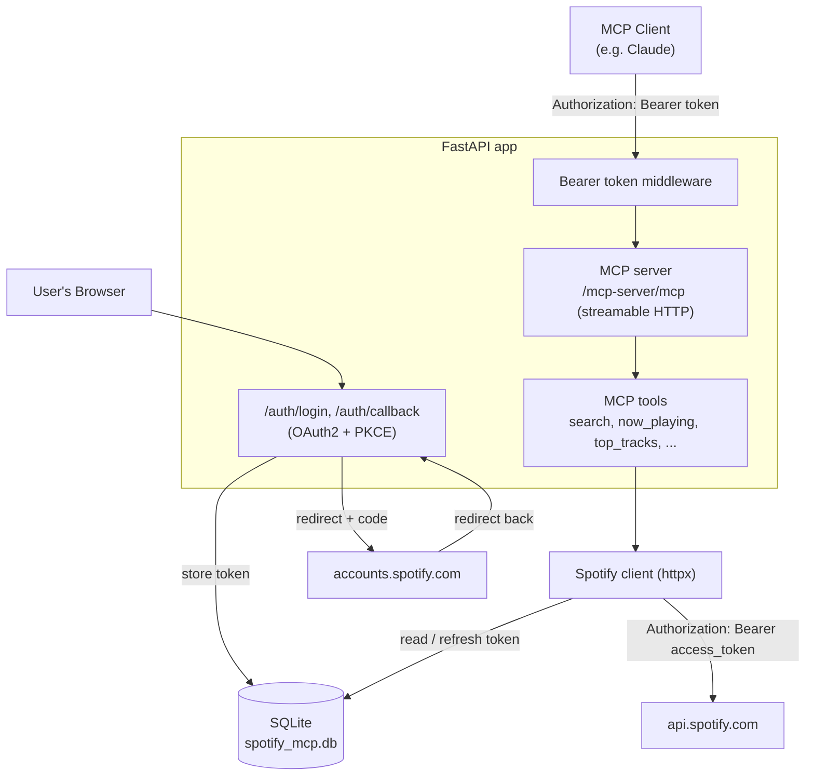

# spotify-mcp

An MCP (Model Context Protocol) server for interacting with the Spotify Web API, built with Python and FastAPI.

This is a portfolio project. The reasoning behind every architecture decision — and why — is logged in [`journal/`](journal/), one entry per decision, in the order they were made.

## How it works

[MCP](https://modelcontextprotocol.io/) is an open protocol that lets an AI client (like Claude) talk to external tools and data sources through a standard interface, instead of custom one-off integrations. A client connects to a server, and the server exposes **tools** the model can call — regular functions with a name, a description, and a typed schema, generated from the function's signature and docstring.

This project is one such server, exposing tools backed by the Spotify Web API. It's a single FastAPI application with two things mounted into it:

- **The MCP server itself**, served over streamable HTTP at `/mcp-server/mcp`, guarded by a bearer token (any MCP-compatible client needs `Authorization: Bearer <token>` to connect, list tools, or call them — it's a network-reachable endpoint now that the transport is HTTP).
- **A Spotify OAuth2 (Authorization Code + PKCE) login flow**, at `/auth/login` and `/auth/callback`, not behind the bearer token — these are reached by the user's browser, not an MCP client, and are already gated by Spotify's own login screen. Spotify data (like "what's currently playing") is user-specific, so the server needs a logged-in user's access token to call the Spotify API on their behalf. PKCE means no client secret has to be kept.

Once logged in, the server stores the access/refresh token pair in a small SQLite database, and transparently refreshes the access token when it's close to expiring.



### Available tools

| Tool | Description |
|---|---|
| `ping` | Health check — confirms the MCP server is reachable. |
| `search_track` | Search Spotify's catalog for tracks matching a query. |
| `now_playing` | Get the track currently playing on the logged-in user's account, if any. |
| `top_tracks` | Get the user's most-listened-to tracks (short/medium/long term). |
| `top_artists` | Get the user's most-listened-to artists (short/medium/long term). |
| `recently_played` | Get the user's most recently played tracks. |
| `list_user_playlists` | List the logged-in user's playlists. |
| `playlist_tracks` | List the tracks in a playlist. |
| `create_user_playlist` | Create a new playlist. |
| `add_tracks` | Add one or more tracks to a playlist. |
| `pause` | Pause playback on the active device. |
| `resume` | Resume/start playback on the active device. |
| `skip_next` | Skip to the next track. |
| `skip_previous` | Skip to the previous track. |
| `set_playback_volume` | Set playback volume (0-100). |
| `queue_track` | Add a track to the playback queue. |

## Setup

**Prerequisites:**
- Python 3.14+
- [uv](https://github.com/astral-sh/uv) for dependency management
- A Spotify account and a [Spotify Developer app](https://developer.spotify.com/dashboard) (free to create)

**1. Install dependencies**

```bash
uv sync
```

**2. Create a Spotify Developer app**

At the [Spotify Developer Dashboard](https://developer.spotify.com/dashboard):
- Create an app (any name/description).
- Add `http://127.0.0.1:8000/auth/callback` as a Redirect URI.
- Under "Which API/SDKs are you planning to use?", check **Web API**.
- Copy the app's **Client ID** (no client secret needed — this project uses PKCE).

**3. Configure environment variables**

```bash
cp .env.example .env
```

Fill in `SPOTIFY_CLIENT_ID` in `.env` with the Client ID from step 2. The other defaults work for local development as-is.

**4. Run the server**

```bash
uv run uvicorn spotify_mcp.main:app --port 8000
```

**5. Log in to Spotify**

Open `http://127.0.0.1:8000/auth/login` in a browser and approve access. This only needs to be done once (until the refresh token is revoked).

**6. Connect an MCP client**

Point any streamable-HTTP-compatible MCP client at `http://127.0.0.1:8000/mcp-server/mcp`.

## Testing

```bash
uv run pytest
```

Tests run against an isolated, throwaway SQLite database and mocked Spotify API responses — they never touch a real Spotify account or the local `spotify_mcp.db`. See [journal entry 11](journal/11-test-suite.md) for details.
